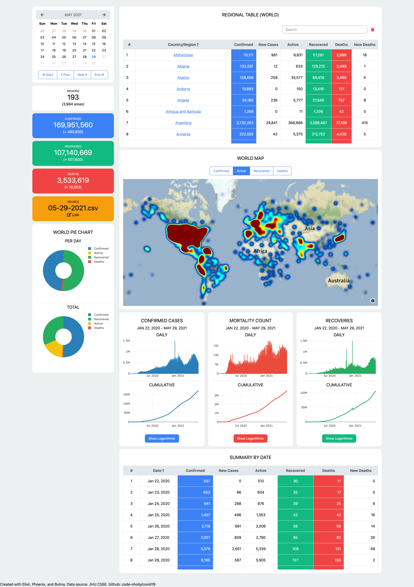
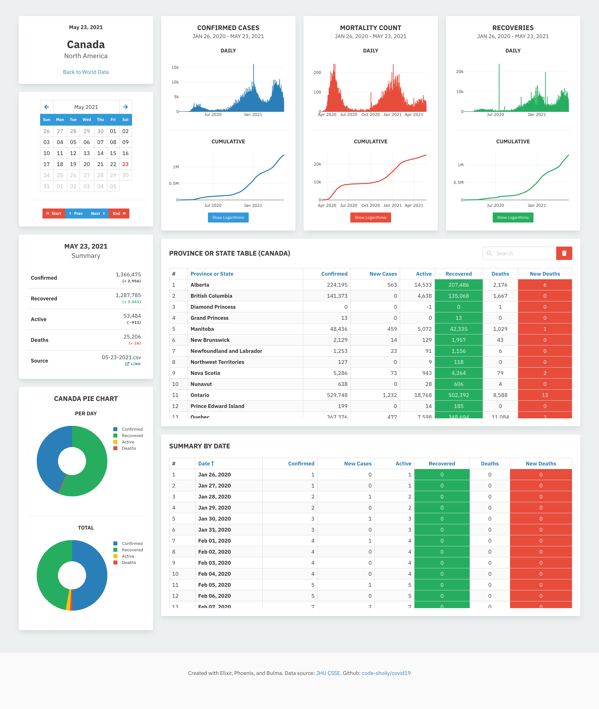

# Covid19

**WIP WARNING** This is very much work in progress, done in haste, focusing more on learning `LiveView` than caring about best practices, tests, and even sanctity of data. Will be dealt with in due time. Also, see the disclaimer below.

This app reads Covid19 dataset from Johns Hopkins CSSE repository, loads it to a database and displays the data in a dashboard made with Phoenix LiveView.

Big thanks goes to Johns Hopkins CSSE and by extension, people behind all those data sources for keeping us updated.

Stay home, flatten the curve

## Setup

#### TODO Write instructions for setting up ClojureScript

To start your Phoenix server:

* Pull the Covid19 dataset submodule with `git submodule update --init --recursive`
* Install dependencies with `mix deps.get`
* Create and migrate your database with `mix ecto.setup`
* Install Node.js dependencies with `cd assets && npm install`
* Start Phoenix endpoint with `mix phx.server`

Now that the system is setup, let's load some data.

* To get the latest dataset from the repository, update the submodules with `git submodule update --recursive --remote`
* To update the Postgres database with the fetched data, run `mix covid19.load`. This will load all dates that have not been updated in the database, so the very first run might take a bit longer.

In order to keep the system updated, repeat the steps above.

Now you can visit [`localhost:4000`](http://localhost:4000) from your browser.

## FAQ

TBA

## Screenshots

### Main Dashboard

### Detail View (WIP)

## Disclaimer

This app massages and displays based on curated datasets and does not attempt to produce or collect any beyond those sources. The datasets come with their own sets of "Terms and Conditions". I respect those and so should you!

This is my attempt to play with Phoenix LiveView and explore data, and by no means intended to be used by anything else, there can and will be wrong data, runtime errors, duplicates, and missing values compared to the data source. If you want to see actual data, google "Coronavirus Statistics" at your own risk, everyone seems to have a widget for it nowadays (Even those come with disclaimers, at least they should). I am doing this because I wanted to do learn some Phoenix LiveView, get less scared and more educated with Corona Virus (any, really) statistics, and convert some boredom (for now).

## Learn more

* Covid Data Source: https://github.com/CSSEGISandData/COVID-19
